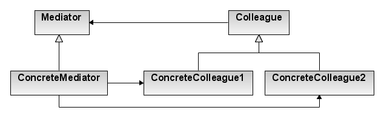

# Mediator Pattern

- 어떻게 객체들의 집합이 상호작용하는지를 함축해놓은 객체를 정의한다.
- 모든 클래스간의 복잡한 로직(상호작용)을 캡슐화하여 하나의 클래스에 위임하여 처리하는 패턴이다.

## 관련 용어
### Mediator
- `Colleague` 객체 간의 상호작용을 위한 인터페이스를 정의한다.

### ConcreteMediator
- 인터페이스를 구현하여 객체 간의 상호작용을 돕는 클래스이다.
- `Colleague`들을 파악하고 관리한다.

### Colleague
- 자신의 중재자 객체가 무엇인지 파악한다.
- 다른 객체와 통신이 필요하면 그 중재자를 통해 통신되도록 하는 객체이다.

### ConcreteColleague
-` Mediator`를 통해 다른 `ConcreteColleague`와 상호작용한다.

## 특징
- M:N의 관계에서 M:1의 관계로 복잡도를 떨어뜨려 유지 보수 및 재사용의 확장성에 유리한 패턴이다.
- [Facade Pattern](/StructuralPattern/Facade/README.md)과 [Observer Pattern](/BehavioralPattern/Observer/README.md)패턴과 유사한 점이 있다.
- 객체들은 다른 객체와 서로 직접 통신하지 않으며 대신 중재자를 통해 통신한다.
  - 통신 객체 간 의존성을 줄일 수 있으므로 **결합도를 감소**시킨다.

## 장점
- 전체적인 연결관계를 이해하기 쉽다.

## 단점
- 특정 애플리케이션 로직에 맞춰져있기 때문에 다른 애플리케이션에서 재사용하기 힘들다.
- 하나의 클래스가 떠맡아야 하는것이 많아질 수 있으므로 God클래스가 생길 수 있다.

## 예제
- [Mediator Pattern](/BehavioralPattern/Mediator/Mediator.cpp)