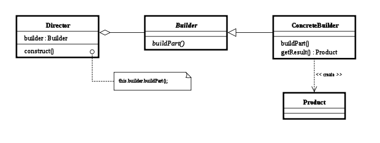

# Builder Pattern

- 복합 객체의 **생성 과정**과 **표현 방법**을 분리하여 동일한 생성 절차에서 서로 다른 표현 결과를 만들 수 있게 하는 패턴이다.
- 팩토리 패턴, 추상 팩토리 패턴과 매우 비슷하다.

## 관련 용어
### Builder
- 인스턴스 생성을 위하나 인터페이스를 선언한다.

### ConcreteBuilder
- Builder 인터페이스를 구현하는 역할을 한다.

### Director
- Builder 인터페이스를 사용해 인스턴스를 생성한다.

### Productor
- 만들어질 제품의 속성과 기능을 가진다.

## 장점
- 객체 생성에 필요한 파라미터의 의미를 코드 단에서 명확히 알 수 있다.
- 생성에 필요한 파라미터가 추가될 때 마다 생성자 오버로딩을 안해도 된다.

## 단점
- 추가적인 빌더 클래스를 구현해야 한다.

## 예제
- [Builder Pattern](/CreationalPattern/Builder/Builder.cpp)