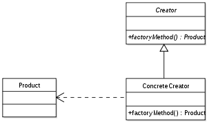

# FactoryMethod Pattern

- 부모 클래스에 알려지지 않은 구체 클래스를 생성하고 서브 클래스가 어떤 객체를 생성할지를 결정하도록 하는 패턴이다.
  - 객체를 만들어내는 부분을 서브 클래스에 위임한다.
- 객체 생성을 캡슐화 하는 패턴
  - 객체 생성을 위한 인터페이스를 정의한다.
  - 어떤 클래스의 인스턴스를 생성할지에 대한 결정은 서브 클래스가 한다.
  - 객체 생성의 변화에 대비하는 데 유용하다.

## 필요성
- 특정 기능의 구현은 개별 클래스를 통해 제공되는 것이 바람직한 설계다.
- 기능의 변경이나 상황에 따른 기능의 선택은 해당 객체를 생성하는 코드의 변경을 초래한다.
- 상황에 따라 적절한 객체를 생성하는 코드는 자주 중복될 수 있다.
- 객체 생성 방식의 변화는 해당되는 모든 코드 부분을 변경해야 하는 문제가 발생한다.

## 관련 용어
### Product
- 팩토리 메서드로 생성될 객체의 공통 인터페이스

### ConcreteProduct
- 구체적으로 객체가 생성되는 클래스

### Creator
- 팩토리 메서드를 정의하는 클래스
- 팩토리 메서드를 호출하여 `Product`를 생성한다.

### ConcreteCreator
- 팩토리 메서드를 구현하는 클래스
- `ConcreteProduct` 객체를 생성한다.

## 장점
- 제품 클래스 계통을 수정하지 않고 쉽게 적용할 수 있다.
  - 동일한 형태로 프로그래밍이 가능하다.
  - 확장성 있는 프로젝트를 구성 가능하다.
- 클래스를 통해 대신 생성한 **객체를 반환 받아 사용**하기 때문에 코드 관리를 효율적으로 할 수 있고 **결합도**를 낮춰 유지보수가 용이하다.

## 단점
- 제품 클래스 계통과 대응되는 팩토리 클래스 계통이 만들어지면서, 제품이 추가될 때마다 팩토리 클래스도 추가되어야 한다.
  - 클래스들이 많아지게 된다.

## 예제
- [FactoryMethod Pattern](/CreationalPattern/FactoryMethod/factoryMethod.cpp)