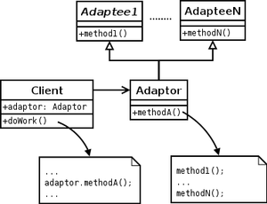
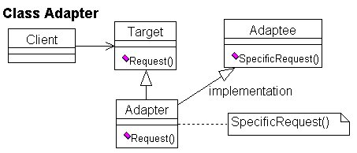
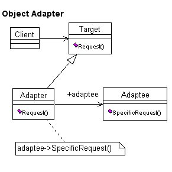

# Adapter Pattern

- 한 클래스의 인터페이스를 사용하고자 하는 **다른 인터페이스로 변환**할 때 사용하는 패턴이다.
- **인터페이스 호환성** 문제 때문에 같이 쓸 수 없는 클래스들을 연결해서 쓸 수 있다.
- 직접적으로 호출하지 않고 중간에 **어댑터를 통해 호출**함으로서 호환성이 없더라도 함께 동작할 수 있고 유지보수를 쉽게 할 수 있다.

## 사용하는 경우
- 이미 존재하고 있는, 버그 적은 클래스를 부품으로서 재사용이 필요할 때 기존의 클래스를 개조해서 필요한 클래스를 만든다.
    - 필요한 함수들을 빠르게 만들 수 있다.
    - 버그가 발생해도 기존의 클래스에는 버그가 없으므로 `Adapter` 역할의 클래스를 중점적으로 조사하면 된다.
- 이미 만들어진 클래스를 새로운 인터페이스에 맞게 개조시킬때는 당연히 Adapter 패턴을 사용해야 한다.
    - `Adapter` 패턴은 기존의 클래스를 전혀 수정하지 않고 목적한 인터페이스에 맞추려는 것이다.
    - `Adapter` 패턴에서는 기존 클래스의 소스 프로그램이 반드시 필요한 것은 아니다.
    - 기존 클래스의 인터페이스만 알면 새로운 클래스를 만들 수 있다.

## Adapter 패턴의 종류
- 클래스에 의한 `Adapter` 패턴 (상속을 사용한 `Adapter`)

- 인스턴스에 의한 `Adapter` 패턴 (위임을 사용한 `Adapter`)

## 관련 용어
### Client
- 써드파티 라이브러리나 외부시스템을 사용하려는 쪽이다.

### Adaptee
- 써드파티 라이브러리나 외부시스템을 의미한다.

### Target Interface
- `Adapter`가 구현(`implements`) 하는 인터페이스이다. 클라이언트는 `Target Interface`를 통해 `Adaptee`인 써드파티 라이브러리를 사용하게 된다.

### Adapter
- `Client` 와 `Adaptee` 중간에서 호환성이 없는 둘을 연결시켜주는 역할을 담당한다.
- `Target Interface`를 구현하며, 클라이언트는 `Target Interface`를 통해 어댑터에 요청을 보낸다.
- 어댑터는 클라이언트의 요청을 `Adaptee`가 이해할 수 있는 방법으로 전달하고, 처리는 `Adaptee`에서 이루어진다.

## 장점
- 관계가 없는 인터페이스 간 같이 사용이 가능하다.
- 프로그램 검사가 용이하다.
- 클래스 재사용성이 증가한다.

## 단점
- 어댑터 클래스에서 통일 시켜주는 부분을 하나씩 구현해야 한다.

## 예제
- [Adapter Pattern](/StructuralPattern/Adapter/Adapter.cpp)