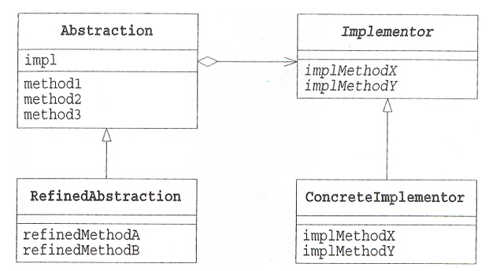

# Bridge Pattern

- 구현부에서 추상층을 분리하여 각자 독립적으로 변형할 수 있게 하는 패턴이다.
- 기능과 구현에 대해서 두 개를 별도의 클래스로 구현을 한다.
- 두개의 다른 계층의 커플링을 약화시키며 협력은 가능하도록 하는 패턴이다.

## 관련 용어
### Abstraction
- **기능 계층**의 최상위 클래스이며 추상화된 인터페이스를 정의한다.
- `Implementor`에 대한 레퍼런스를 유지한다.
- 구현 부분에 해당하는 클래스를 인스턴스를 가지고 해당 인스턴스를 통해 구현부분의 메서드를 호출한다.

### RefindAbstraction
- `Abstraction`에 의해 정의된 인터페이스를 **확장**한다.
- **기능 계층**에서 새로운 부분을 확장한 클래스이다.

### Implementor
- **구현 클래스**를 위한 인터페이스를 정의한다.
- `Abstraction`의 기능을 구현하기 위한 인터페이스를 정의한다.

### ConcreteImplementor
- 실제 기능을 **구현**한다.

## Adapter 패턴의 차이
- 두 패턴 모두 인터페이스의 세부사항을 감추고자 하며, 구조적인 차이가 없다.
- 서로 사용하고자 하는 목적의 차이가 분명하다.
- `Adapter`는 어떤 클래스의 인터페이스가 다른 코드에서 기대하는 것과 다를 때 어댑터를 중간에 두어 맞춰주는 것이다.
- `Bridge`는 추상과 구현을 분리하는 것이다.
- `Adapter`는 설계가 완료 된 후 요구 사항을 적용하기 위해 사용되고 `Bridge`는 설계 진행 중에 적용 시켜 두 레이어로 분리시키는 것이다.

## 예제
- [Bridge Pattern](/StructuralPattern/Bridge/Bridge.cpp)