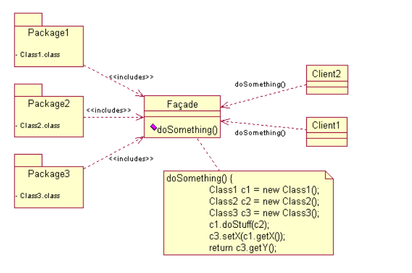

# Facade Pattern

- 소프트웨어의 복잡한 코드에 대한 **간략화된 인터페이스**를 제공하는 객체이다.
- 서브 시스템을 간략하게 사용할 수 있게 해주는 패턴이다.

## 특징
- 소프트웨어 라이브러리를 쉽게 사용할 수 있게 해준다. 
- 라이브러리를 사용하는 코드들을 좀 더 읽기 쉽게 해준다.
- 라이브러리 바깥쪽의 코드가 라이브러리의 안쪽 코드에 의존하는 일을 감소시켜준다.
- `API`의 집합을 하나의 좋게 작성된 `API`로 감싸준다.

## 관련 용어
### Facade class
- 패키지 1,2,3 및 그림에 나오지 않은 그 밖의 응용 프로그램 코드와 상호 동작한다.

### Client
- 패키지 내의 리소스들을 접근하기 위해 `Facade Class`를 쓰는 객체들이다.

### Package
- 소프트웨어 라이브러리 / `API` 집합이다.
- `Facade Class`를 통해 접근된다.

## 예제
- [Facade Pattern](/StructuralPattern/Facade/Facade.cpp)