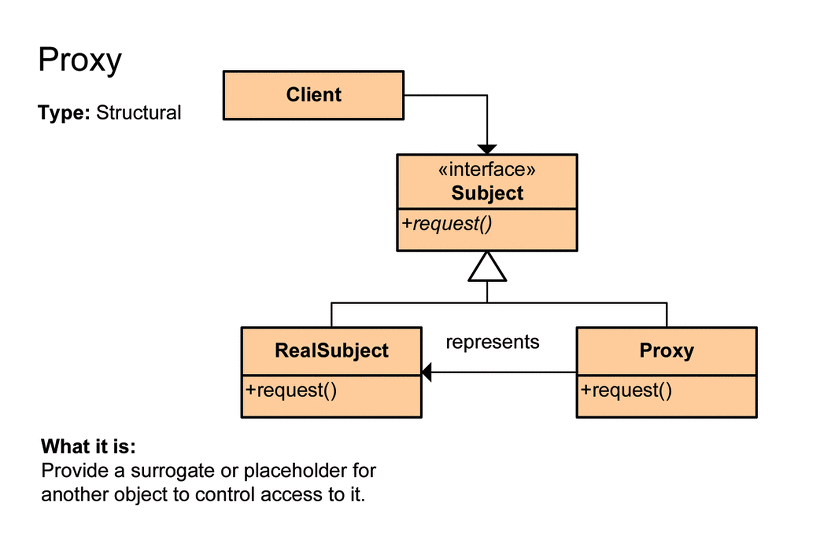

# Proxy Pattern

- **프록시 객체**를 통해 기본 객체에 접근하는 패턴이다.
  - 프록시는 다른 무언가와 이어지는 인터페이스의 역할을 하는 클래스이다.
  - 프록시는 어떠한 것(이를테면 네트워크 연결, 메모리 안의 커다란 객체, 파일, 또 복제할 수 없거나 수요가 많은 리소스)과도 인터페이스의 역할을 수행할 수 있다.
- 프록시는 흐름제어만 할 뿐 결과값을 조작하거나 변경시켜서는 안된다.
- 잘 알려진 예로는 참조 횟수 스마트 포인터 객체가 있다.

## 관련 용어
### Subject
- `Proxy` 와 `RealSubject`가 구현해야 하는 인터페이스이다.
- 두 객체를 동일하게 다루기 위해 존재한다.

### Proxy
- `RealSubject` 와 클라이언트 요청 사이에 존재하는 객체이다.
- `Subject` 를 구현함으로써 클라이언트는 `RealSubject`를 사용하는 것과 별 차이가 없어야 한다.

### RealSubject
- 요청에 대해 주된 기능을 실질적으로 수행하는 객체이다.
- `Proxy` 객체는 내부적으로 이 객체를 로직에 맞게 사용한다.

## 장점
- 외부로부터 숨기기 때문에 안전하다.
- 실제 기능을 담당하는 객체의 리소스가 클 경우 `Proxy` 객체에서 처리를 통해 부하를 줄일 수 있다.

## 단점
- 시스템이 거대해질 수록 일부는 `Proxy`에 직접 접근, 일부는 실제 객체에 직접 접근하는 이질적인 설계가 발생할 수 있다.
- 클라이언트 - 실제 객체 사이에 프록시 객체가 있는 상황이기에 응답이 느리거나 에러를 발생할 가능성이 있다.

## 종류
### Virtual Proxy(가상 프록시)
- 필요로 하는 시점까지 객체의 생성을 연기하고, 해당 객체가 생성된 것처럼 동작하도록 만들고 싶을때 사용한다.
- 프록시 클래스에서 간단한 작업들을 처리하고 리소스가 많이 요구되는 작업들이 필요할 때에만 주체 클래스를 사용하도록 한다.

### Remote Proxy(원격 프록시)
- 프록시 클래스는 로컬에 두고 주체 클래스는 원격으로 존재하는 경우이다.
- 예로는 `Google Docs`가 있다.
  - 브라우저는 브라우저대로 필요한 자원을 로컬에 가지고 있고 일부 자원은 `Google`서버에 있는 형태이다.

### Protection Proxy(보호 프록시)
- 주체 클래스에 대한 접근을 제어하기 위한 경우이다.
- 프록시 클래스에서 클라이언트가 주체 클래스에 대한 접근을 허용할지 말지 결정하도록 할 수 있다.
- 어떤 접근권한을 가지고 있는지에 따라 그에 맞는 주체 클래스의 메소드를 호출하도록 구현할 수 있다.

## 예제
- [Proxy Pattern(가상 프록시)](/StructuralPattern/Proxy/Proxy.cpp)